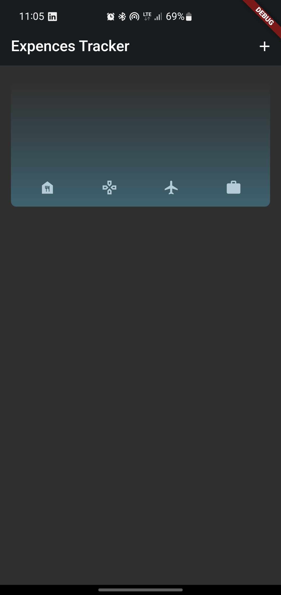
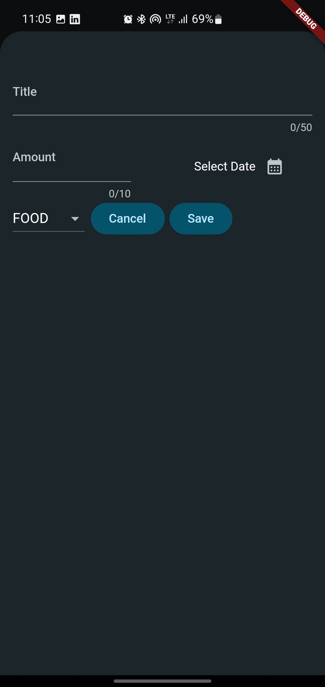
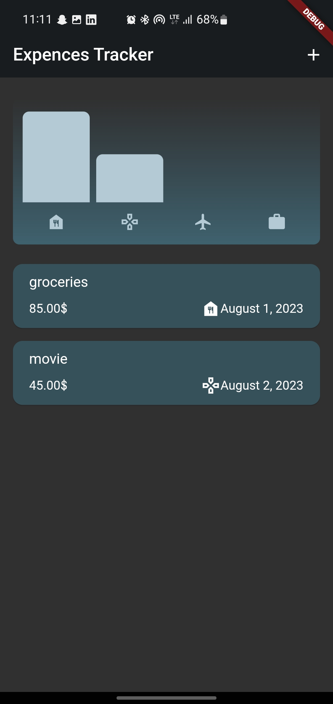

# expences_tracker

The Expense Tracker Flutter App is a straightforward mobile application designed to help you manage and your expenses with ease. This user-friendly app enables you to log your expenses, categorize them, and track your spending over time. Whether you're a budget-conscious individual or someone looking to gain better control of their finances, this app provides a simple solution to stay on top of your expenses.
<h1>Screenshots</h1>

